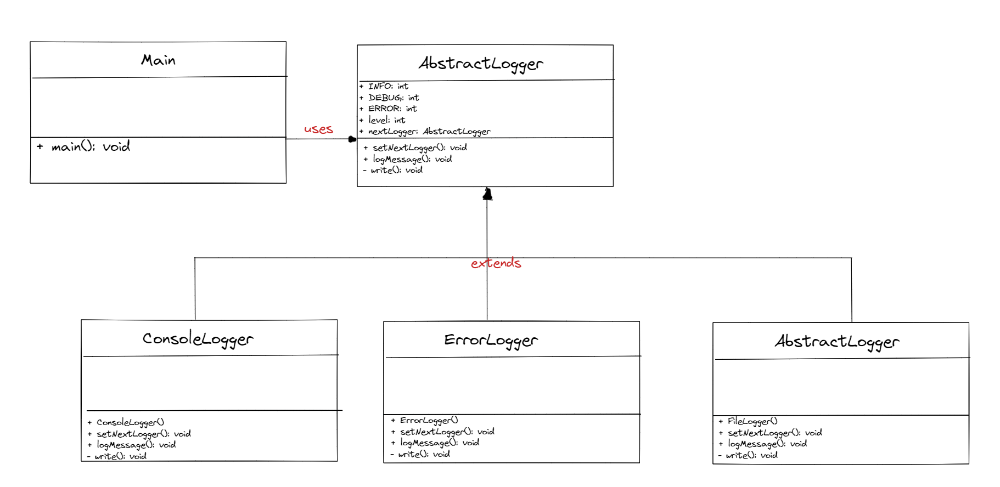

## Chain of Responsibility

**Chain of Responsibility (Sorumluluk Zinciri), bir isteğin işlenmesi için bir dizi nesne veya işlev arasında sorumluluk paylaşımını sağlayan bir davranışsal tasarım kalıbıdır.**

**Bu desen, isteği gönderen nesne ile işleyen nesne arasında sıkı bir bağlantı olmadan, birçok nesne arasında dinamik olarak sorumluluk paylaşımını sağlar. İstek, zincirdeki her bir nesne tarafından işlenir ve nihayetinde bir nesne tarafından işlenmezse, zincirin sonunda bir sonuç üretilir.**

**Chain of Responsibility deseni genellikle bir işlemde birden fazla adımın olması gerektiği durumlarda kullanılır. Her bir adım, işlemin bir parçasını gerçekleştirir ve başarılı bir şekilde tamamlanırsa, sonraki adıma geçilir. Ancak bir adım başarısız olursa, zincir sona erer ve işlem sonlandırılır.**

**Bu desen, uygulamanın esnekliğini artırır, çünkü yeni adımlar eklemek veya mevcut adımları kaldırmak kolaydır. Ayrıca, kod tekrarını azaltır ve işlemleri birleştirmek için kullanılabilir.**

**Chain of Responsibility deseni için bazı örnekler şunlardır:**

- **Bir müşteri hizmetleri sistemi, bir müşteri şikayeti aldığında, şikayeti ele almak için farklı departmanlar arasında sorumluluk zinciri kurabilir.**
- **Bir programlama dilinde, bir hata ayıklayıcısı zinciri, hata ayıklama işlemini yapmak için farklı araçlar arasında sorumluluk paylaşabilir.**

