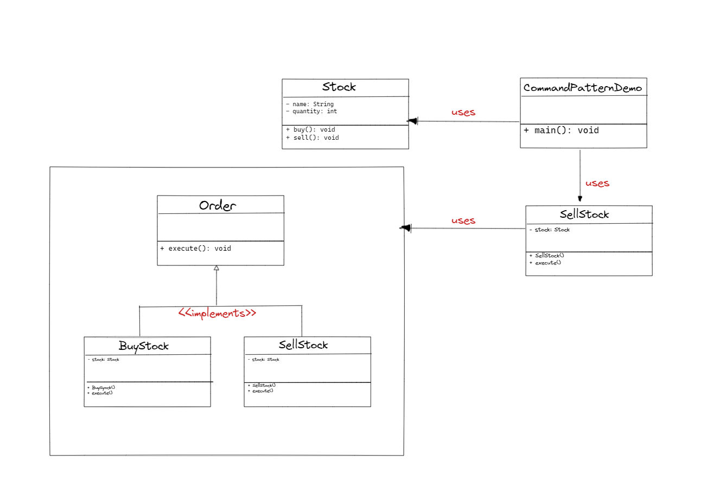

## :diamond_shape_with_a_dot_inside: Command Pattern

**Command ( Komut ) tasarım deseni, bir isteği kendisi ile ilgili tüm bilgileri içeren bağımsız bir nesneye dönüştüren davranışsal bir tasarım desenidir. Bu dönüşüm, istekleri metot parametresi olarak göndermenize, işlenmelerini geciktirmenize ya da sıraya sokmanıza ve geri alınamaz işlemleri desteklemenize olanak verir.**

**Command design pattern, bir isteği nesne olarak paketleyerek isteği gönderen nesne ile isteği işleyen nesneyi birbirinden ayırır. Bu sayede istekleri sırayla işlemek, istekleri geri almak (undo) veya yeniden uygulamak (redo) mümkün hale gelir.**

**Command design pattern, temel olarak aşağıdaki unsurlardan oluşur:**

- **Command: İsteği temsil eden arayüzü tanımlar.**
- **Concrete Command: Command arayüzünü uygular ve bir Receiver nesnesi üzerinde bir eylem gerçekleştirir.**
- **Receiver: İsteği gerçekleştiren nesnedir.**
- **Invoker: Command nesnesini alır ve gerçekleştirmesi için Receiver'a iletir.**
- **Client: Command nesnelerini oluşturur ve Invoker nesnesine verir.**

**Command design pattern, özellikle işlem geri alma/red etme, işlemleri sırayla işleme ve dinamik olarak komutları değiştirme gibi durumlarda kullanışlıdır. Örneğin, bir metin editöründe yaptığımız değişiklikleri geri almak veya yeniden uygulamak, bir müzik çalar uygulamasında müzikleri duraklatmak, oynatmak veya atlamak için kullanılabilir.**

