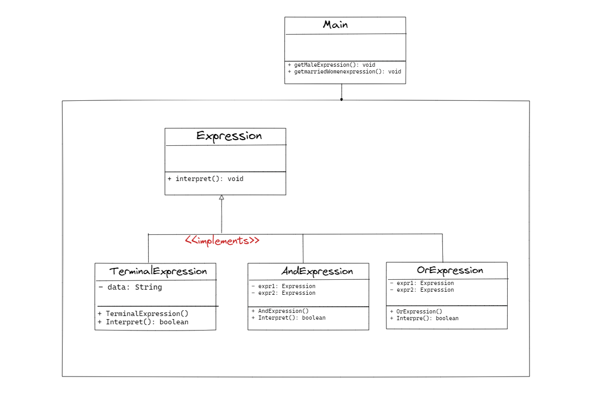

## :diamond_shape_with_a_dot_inside: Interpreter Pattern

**Interpreter, bir dilin belirli bir dilbilgisi yapısını yorumlamak için kullanılır. Bu tasarım deseni, belirli bir görevi yerine getirmek için belirli bir dili yorumlama ihtiyacı olan uygulamalar için kullanışlıdır. Bu tasarım deseni, bir dilin belirli bir bölümünü (genellikle bir dilbilgisi ağacını) işleyen bir sınıf ağacı içerir.**

**Bu tasarım deseni, bir söz dizimini parçalara ayırmak, bu parçaları bir sözlüğe dönüştürmek ve bu sözlüğe dayalı bir davranış sergilemek için kullanılabilir. Interpreter, genellikle bir DSL (Domain Specific Language) oluşturmak için kullanılır.**

**Örneğin, bir matematiksel ifadeyi çözmek için kullanılabilir. Bir matematiksel ifade, sembolik olarak işlemleri temsil eden farklı sembollerden oluşur. Interpreter, ifadeyi sözdizimini okuyup bu sembolleri çözerek, sonucu elde etmek için kullanılabilir.**

**Bu tasarım deseninin temel bileşenleri arasında Context (bağlam), Terminal Expression (terminal ifade) ve Non-Terminal Expression (terminal ifade olmayan) yer alır.**

**Context, yorumlamada kullanılan verilerin saklandığı sınıftır. Terminal Expression, yorumlanan söz dizimindeki son düğümleri temsil eder. Non-Terminal Expression ise, terminal ifade olmayan düğümleri temsil eder ve yorumlama sırasında alt düğümlerini yorumlamak için tekrar yorumlayabilir.**

**Interpreter tasarım deseninin avantajlarından bazıları şunlardır:**

- **Dilbilgisi kurallarının yürütülmesi için kullanılabilir.**
- **Bir doğal dil yorumlamak için kullanılabilir.**
- **Yeni bir yorumlama işlevselliği eklemek kolaydır.**
- **Yeni söz dizimi kuralları eklemek kolaydır.**

**Bununla birlikte, Interpreter tasarım deseninin dezavantajlarından bazıları şunlardır:**

- **Yorumlama süreci performans açısından maliyetlidir.**
- **Yeni bir söz dizimi kuralı eklemek zor olabilir.**
- **Büyük ve karmaşık sözdizimleri için zor olabilir.**

**Örneğin, bir müzik notasyonu yorumlamak için Interpreter tasarım deseni kullanılabilir. Müzik notası bir dizi sembolden oluşur ve Interpreter, notasyonu yorumlayarak müzikal notaları elde etmek için kullanılabilir.**

