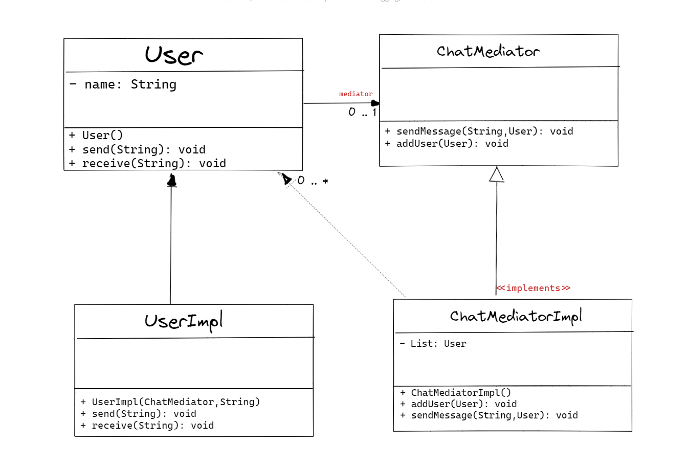

## :diamond_shape_with_a_dot_inside: Mediator Pattern

**Mediator tasarım deseni, nesneler arasındaki iletişimi düzenlemek ve nesneler arasındaki ilişkiyi gevşetmek için kullanılır. Bu tasarım deseni, nesnelerin birbirleriyle doğrudan iletişim kurmaları yerine bir aracı aracılığıyla iletişim kurmalarını sağlar.**

**Bu desen, bir arayüz aracılığıyla aracı nesneleri yönetir ve iletişim protokollerini yönetir. Mediator tasarım deseni, sistemdeki nesneler arasındaki bağımlılığı azaltır ve nesnelerin birbirlerinin iç yapısını bilmeden iletişim kurmalarını sağlar.**

**Örnek olarak bir uçuş sistemi düşünebilirsiniz. Uçakların kalkış ve inişleri için bir hava trafik kontrol merkezi vardır. Uçaklar, hava trafik kontrol merkezi aracılığıyla diğer uçaklarla ve havalimanlarıyla iletişim kurar. Bu durumda hava trafik kontrol merkezi, Mediator olarak hareket eder.**

