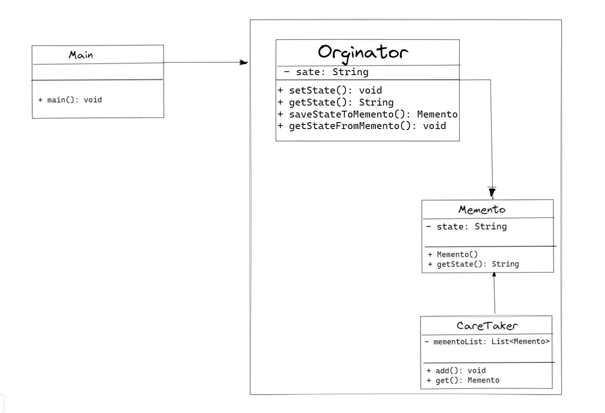

## :diamond_shape_with_a_dot_inside: Memento Pattern

**Memento, Behavioral (Davranışsal) tasarım desenlerinden biridir. Memento deseni, bir nesnenin iç durumunu kaydetmek ve gerektiğinde geri yüklemek için kullanılır. Bu desen, bir nesnenin geçmiş durumlarına geri dönme ve durumları geri alma yeteneği sağlar.**

**Memento deseninde üç ana bileşen vardır:**

1. **Originator (Oluşturucu): Durumu kaydetmek ve geri yüklemek isteyen nesnedir. Originator, Memento nesnesini oluşturur ve iç durumunu bu nesne üzerinden kaydeder veya geri yükler.**
2. **Memento: Originator'un iç durumunu temsil eden nesnedir. Memento, Originator tarafından oluşturulur ve Originator'a geri yükleme işlemi için gereken bilgileri sağlar.**
3. **Caretaker (Koruyucu): Memento nesnesini saklayan ve gerektiğinde geri yükleyen nesnedir. Caretaker, Memento'yu Originator'dan alır ve gerektiğinde Originator'a geri yüklemek için kullanır.**

**Memento deseni, bir nesnenin iç durumunu koruyarak, geri alma işlemi yapılabilir veya durum geçmişi incelenebilir. Bu desen, özellikle geri alma, geriye dönük navigasyon ve geçmiş durumları yönetme gibi durumlar için kullanışlıdır.**

**Örneğin, bir metin düzenleyici uygulaması düşünelim. Kullanıcı, yazdığı metindeki değişiklikleri geri alma veya ileriye yönelik tekrar etme ihtiyacı duyabilir. Bu durumda, Memento deseni kullanarak her değişiklik sonrasında bir Memento nesnesi oluşturulabilir ve bu nesneler Caretaker tarafından saklanabilir. Kullanıcı geri alma işlemi yapmak istediğinde, Caretaker Memento nesnesini kullanarak önceki bir durumu geri yükleyebilir.**

**Bu şekilde, Memento deseni uygulanarak bir nesnenin durum geçmişi yönetilebilir ve geri alma işlemleri kolayca gerçekleştirilebilir.**

